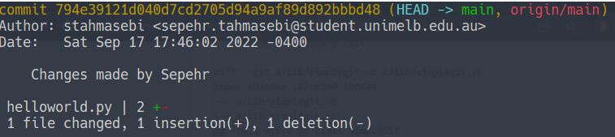
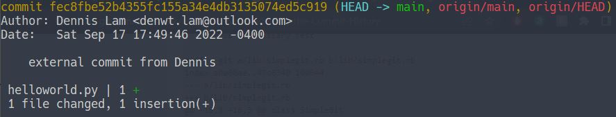
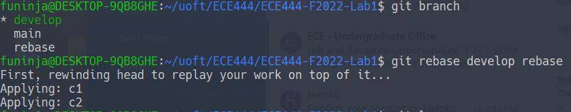
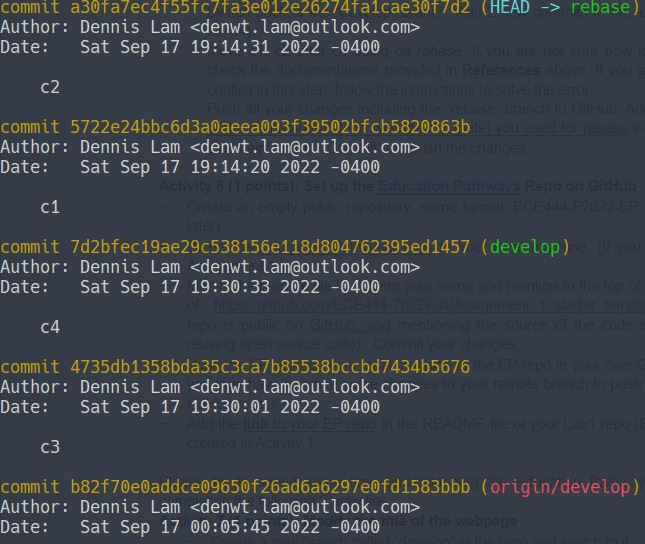
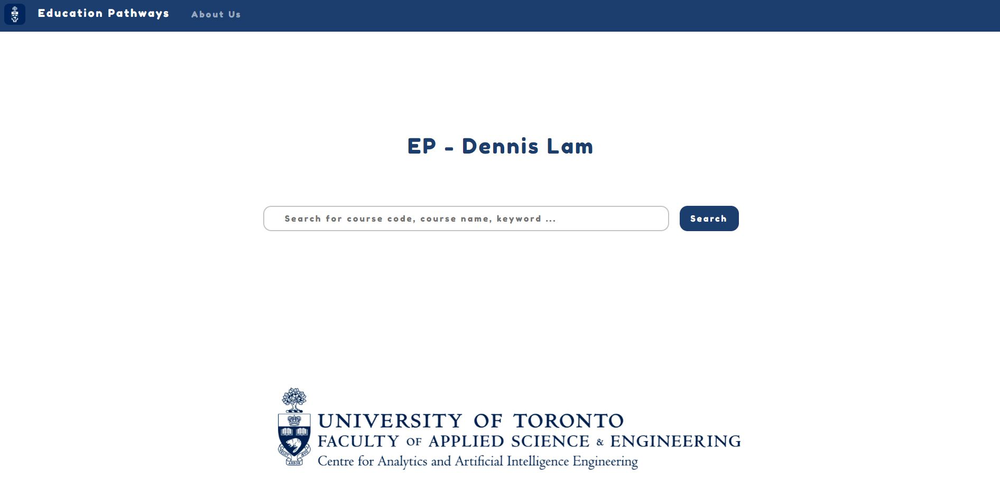
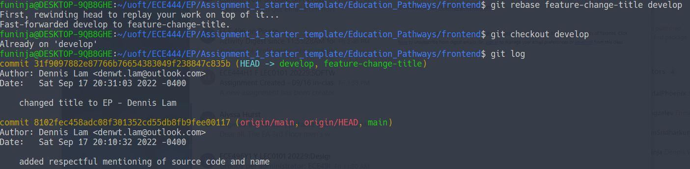
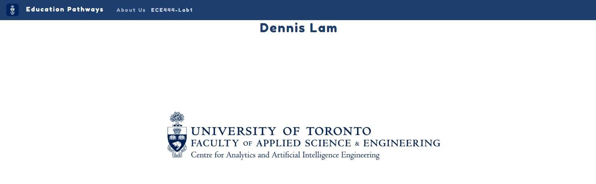
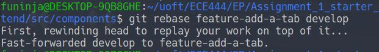

Dennis Lam
 
**Activity 1**

 
**Activity 2**

 
**Activity 3**
 

 
**Activity 4**
 
Link to Other Repo: https://github.com/sepair/ECE444-F2022-Lab1/tree/main 
 

 

 
**Activity 5**
 

 

 
**Activity 6**
 
The link for the EP-repo: https://github.com/Funinja/ECE444-F2022-EP
 
**Activity 7**
 

 

 
**Activity 8**
 

 

 
